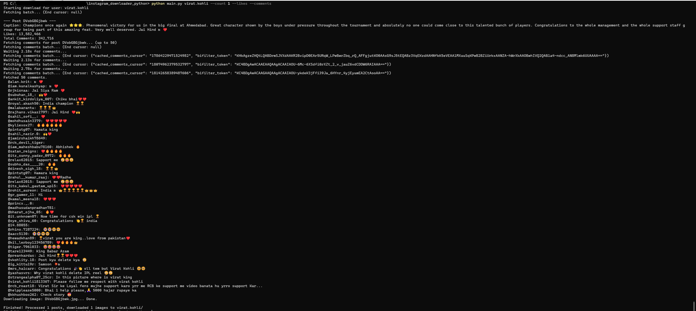

# Instagram Media Downloader (Python)

A modular Python script to download images from a public Instagram profile.

## Features
- Modular design: client, parser, paginator, downloader.
- Supports single images and carousel posts.
- Skips videos.
- Rate limiting protection (random delays).
- Configurable download limit.
- Optional display of like counts and comments for each post.

## Structure
- `client.py`: Handles HTTP requests to Instagram APIs.
- `parser.py`: Extracts image URLs from API responses.
- `paginator.py`: Handles pagination using `end_cursor`.
- `downloader.py`: Downloads images and saves them to disk.
- `main.py`: CLI entry point.
- `requirements.txt`: Project dependencies.

## Installation

1. Clone the repository:
   ```bash
   git clone <repository_url>
   cd instagram_downloader_python
   ```

2. Install dependencies:
   ```bash
   pip install -r requirements.txt
   ```

3. Set up constants:
   - Copy `constants.example.py` to `constants.py`
   - Edit `constants.py` with your Instagram API credentials (app ID, CSRF token, session cookie, etc.)
   - **Important**: Never commit `constants.py` to the repository

4. Run the downloader:
   ```bash
   python main.py <instagram_username> [--count <number_of_posts>] [--likes] [--comments]
   ```

## Options
- `--count <number>`: Number of posts to process (default: unlimited)
- `--likes`: Display like counts for each post
- `--comments`: Fetch and display up to 50 comments for each post

## Examples
Download 10 posts from `mahi7781`:
```bash
python main.py mahi7781 --count 10
```

Download posts with like counts and comments:
```bash
python main.py mahi7781 --likes --comments
```

## Output Example


This shows the typical output when running the script with likes and comments enabled.
